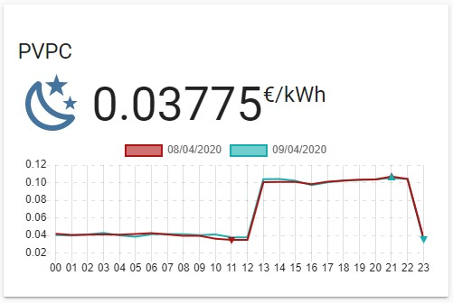

[](https://github.com/custom-components/hacs)

# PVPC Hourly Pricing Card

Home Assistant Lovelace custom card to use with [Spain electricity hourly pricing (PVPC) integration](https://www.home-assistant.io/integrations/pvpc_hourly_pricing/).



> This card only works with a [previously configured Spain electricity hourly pricing (PVPC) integration](https://www.danielmartingonzalez.com/pvpc-tariff-prices-in-home-assistant/) in Home Assistant.

Based on [Lovelace Weather Card with Chart](https://github.com/sgttrs/lovelace-weather-card-chart) by [Yevgeniy Prokopenko](https://github.com/sgttrs) and the fork [Lovelace Animated Weather Card](https://github.com/MarcHagen/weather-card) by [Marc Hagen](https://github.com/MarcHagen).

## Features

- Compatible with all rates.
- Actual price close-up.
- Graph with the prices of the current day.
- Graph with the prices of the next day when you are available.
- Lowest and Highest of the current and next day.
- Icon indicating the current pricing period.

## Installation

You could use [HACS](https://hacs.xyz/) or follow this [guide](https://www.danielmartingonzalez.com/installing-lovelace-plugins).

```yaml
resources:
  url: /local/pvpc-hourly-pricing-card.js?v=0.0.1
  type: module
```

## Options


| Name | Type | Default | Requirement | Description |
| --- | --- | --- | --- | --- |
| type | string | `null` | **Required** | `custom:pvpc-hourly-pricing-card` |
| entity | string | `null` | **Required** | Spain electricity hourly pricing (PVPC) entity |
| name | string | `null` | Optional | Title of the card |
| current | boolean | `true` | Optional | Show the current price and pricing period |
| details | boolean | `true` | Optional | Show the lowest and highest prices and hours for the current and next day |
| graph | boolean | `true` | Optional | Show the graph with the prices for the current and next day |
| info | boolean | `true` | Optional | Show info like 'Tomorrow's data is no yet available' |

## Example

### Mode Storage (Visual)

From your Lovelace Dashboard: *Configure UI ➡ Add New Card ➡ Manual Card* and then this code:

```yaml
type: custom:pvpc-hourly-pricing-card
name: "PVPC 2.0 DHA"
entity: sensor.pvpc_2_0_dha
```

### Mode YAML

Add this lines of code to your Lovelace Dashboard YAML file:

```yaml
...
cards:
  ...
  - type: custom:pvpc-hourly-pricing-card
    name: "PVPC 2.0 DHA"
    entity: sensor.pvpc_2_0_dha
  ...
```
